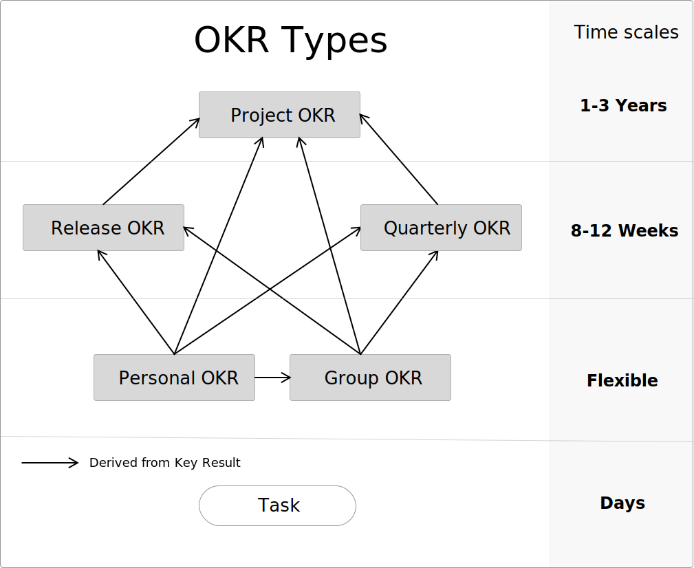
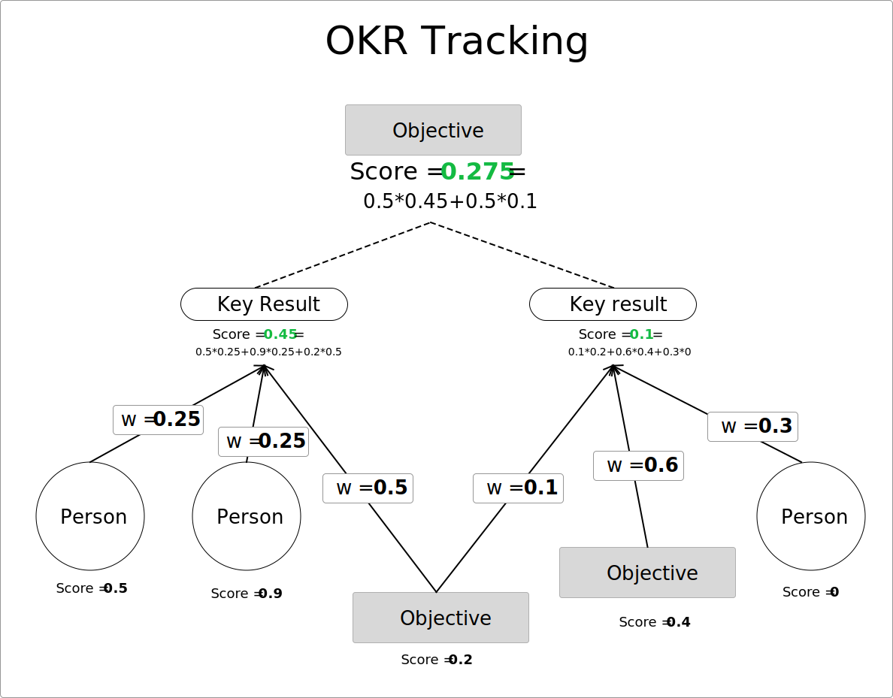

Project Management

# Table of contents

- [Why is this on Github?](#why-is-this-on-github?)
- [Meetings](#meetings)
  - [Daily standup](#daily-standup)
  - [Monday all-hands](#monday-all-hands)
  - [Release meeting](#release-meeting)
- [OKR System](#okr-system)
  - [Assignment](#assignment)
  - [OKR types](#okr-types)
  - [Hierarchy](#hierarchy)
  - [Tracking](#tracking)
  - [Schema](#schema)
- [OKRs](#okrs)
  - [Project OKRs](#project-okrs)
  - [Quarterly OKRs](#quarterly-okrs)
  - [Release OKRs](#release-okrs)
  - [Personal OKRs](#personal-okrs)

# Why is this on Github?

The reason this is placed in public view on Github is that two fold

- **Open Invitation:** Serve as an open invitation for anyone who wants to learn, comment and possibly contribute, to the current or future development of the Joystream project.

- **Best Practices**: Establish best practices which can be replicated by the platform, when it is fully live, in how to collaboratively build and manage the platform using open tools. In particular, the current plan is that the platform has a built in Github equivalent, which thus would allow the use of these conventions.

# Meetings

## Itinerary

Meeting itineraryies are prepared on a case by case basis, depending on the context, anda template for this, as well as an index of archived itineraries, can be found [here](/meetings).

## Meeting Types

### Daily standup

- **Description:** Everyone states, within 1 minute, what they accomplished the prior day, and what the goals are for the day. After this, people can start separate calls which need not be conducted in plenum.
- **When:** Every day at 10am (GMT)
- **Where:** Zoom
- **Participant:** Core Jsgenesis team _must_ be present, any one else is welcome (join Rocket.Chat for invite).
- **Record&Publish:** YES, if no participant objects.

### Monday all-hands

- **Description:** Everyone states individual:
  1. **OKR Tracking**: Track your OKRs and OKR assignments
  2. **Health Comments:** Any points you wish to discuss related to things like team health, code health, workflow/system health etc.
  3. **Weekly Priorities:** Your top 3-5 priorities this week. *Not* the same as your tasks today.
  4. **Announcements:** Anything you think should be brought to everyones attention.
- **When:** Every working monday at 10am (GMT)
- **Where:** Zoom
- **Participant:** Core Jsgenesis team _must_ be present, any one else is welcome (join Rocket.Chat for invite).
- **Record&Publish:** YES, if no participant objects.

### Release meeting

- **Description:** Discussion about impending testnet release.
- **When:** Weekly
- **Where:** Zoom
- **Participant:** Core release team _must_ be present, any one else is welcome (join Rocket.Chat for invite).
- **Record&Publish:** YES, if no participant objects.

# OKR system

Project management is primarily centred around planning and tracking OKRs. OKRs is a planning and project management system, which can be reviewed in further detail [here](https://en.wikipedia.org/wiki/OKR).

## Assignment

A key result can be _assigned_ to a mix of people or other objectives. The _assignment set_ of a key result consitutes the set of relevant actors, directly or indirectly - for OKRs, that are working to satisfy the result. Each assignment is given a weight from 0 to 1, and the total weight across an assignment set is 1. Some key results, in particular for very higher order OKRs, may not have assignments at all times.

## OKR types

The OKRs can be classified into two separate families of types, first

- **Project OKRs**: Project OKRs run over multiple years and are graded very rarely. They contain the root objectives that require no deeper justification. Every other objective must be justified directly, or indirectly through another key result, by virtue of its relevance to the project OKRs. The current set of such OKRs can be found [below](#project-okrs).

- **Quarterly OKRs**: Every quarter, new OKRs for the given quarter are derived, referred to as quarterly OKRs. Only OKRs which have independent objectives are formally referred to as quarterly OKRs, any derivative OKR is not, even if derived at the start of a quarter. Importantly, they should contain very little detail about releases. The current set of such OKRs can be found [below](#quarterly-okrs).

- **Release OKRs**: Releases are planned one after the other on a rolling basis, and the release OKRs correspond to a single release. Only OKRs which have independent objectives are formally referred to as release OKRs, any derivative OKR is not, even if derived at in the context of a release. The current set of such OKRs can be found [below](#release-okrs)

and then second

- **Group OKRs**: Group OKRs are defined by the set of stakeholders assigned to the key results, and in particular that there is more than one person involved. Typically this could be a set of people working as a team on some topic or problem. In principle, such an OKR can be rationalised by a mix of release and quarterly OKRs, but in practice it will most often just be one or the other. These OKRs should be flexible in time scope, and should be reorganized if circumstances change. The current set of such OKRs can be found [below](#group-okrs).

- **Personal OKRs**: The exact same thing as personal OKRs, only applying to a single person only. The current set of such OKRs can be found [below](#personal-okrs).

_Note: As a matter of definition, its important to realise that any OKR from the first family, assigned to a single person, is not actually a personal OKR, or alternatively a group OKR if assigned to multiple people._

The following figure attempts to summarise how these OKR families and types are related, and their relevant temporal scopes.

## Hierarchy

All OKRs, except the project OKR, should be derived, in terms of its objective, from one or more key results of already existing higher order OKRs.

## Tracking

In order to keep track of whether a key result, and thus the corresponding objective, will in the end be satisfied, forecasts are tracked throughout the lifetime of an OKR. Each OKR has its own periodic tracking of progress, and to compute the its forecasted value, do as indicated in the example figure below.

Briefly, do a topological sort of the key result graph, where having an objective in the result assignment set counts towards the indegree. Then just do ascending weighted averaging of scores, where key results are simply averaged into objective scores. Importantly, in order to do this, one has to get personal scores on key results, and there are two modes of doing this

- **Naive**: Simply evaluate the key result statement directly based on available data at the time. For example, if the result is `Get $100 in revenue`, and one has $20 so far, then the score would be 0.2. This method is often suitable, but no if partial work is unlikely to have had any real world effects while tracking.

- **Planned Work Done**: Fraction of estimated total hours required that have been completed. This means that, if the estimate of total time required changes, then the score can change, even there is not change in actual hours completed.

The mode used depend on the nature of the key result.

## Schema

The schema used for recording and tracking OKRs has the following form:

 - **Objective:** `<Name of objective>`
 - **KR Measurement Deadline**: `<When the final grading is conducted>`
 - **Tracked**: `<Time interval at which OKR is tracked>`
 - **Tracking Manager**: `<Name of person responsible for doing tracking, at given interval, and final grading>`
 - **Key Results**: `<If all key results have same assignment set, write here>`
   1. `<Statement of Key result>`
     - `<Name of assignment>`: `<assignment weight>`
     - ...
 - **Tracking:**

| Date     | KR #1 | ... |  Total |
|:--------:|:-----:|:-----:|:--------------:|
| `<date&time>` | (`<... assignment set scores>`)  **Total KR score**  | ... |  **Tracked objective score** |

# OKRs

## Project OKRs

### Objective: `Launch a functional, upgradable video platform, governed and operated by a vibrant community`
- **KR Measurement Deadline:** Joystream autonomous network live
- **Tracked:** Every 6 months
- **Tracking Manager:** Martin
- **Key Results:**
  1. `All (IT) infrastructure roles are contested, and at least one professional for profit operation is taking part`
  2. `There are at least 10 builders, with at least 2 in a full time capacity`
  3. `There are at least 100 active governance or operations focused daily active members`
  4. `There are at least 10000 daily active members, as measured by any kind of use of the platform`
  5. `<... something about publishers/content. ..>`
- **Tracking:**

| Date     | KR #1 | KR #2 | KR #3 | KR #4 | KR #5 |  Total |
|:--------:|:-----:|:-----:|:-----:|:-----:|:-----:|:------:|
| 01.06.19 |    NA  |   NA    |  NA     |  NA     |    NA    |     **NA**  |

## Quarterly OKRs

### Objective: `Expand the Jsgenesis team`
- **KR Measurement Deadline:** xxxx
- **Tracked:** Weekly
- **Tracking Manager:** Martin
- **Key Results:** all assigned to Martin and Bedeho equally
  1. `Add full 3 full time blockchain developers`
  3. `Add full 1 time full stack developer`
  4. `Source 25 candidates outside of angel/jsg/dribble/hh`
  5. `Interview at least 25 candidates once, and 15 candidates twice`
- **Tracking:**

| Date     | KR #1 | KR #2 | KR #3 | KR #4 | KR #5 |  Total |
|:--------:|:-----:|:-----:|:-----:|:-----:|:-----:|:------:|
| 18.03.19 |     x  |   x    |  x     |  x     |    x    |     **x**  |

### Objective: `Launch and grow Staked podcast`
- **KR Measurement Deadline:** End of Q1
- **Tracked:** Every 2 weeks
- **Tracking Manager:** Martin
- **Key Results:**
  1. `Launch a new branded podcast available in all major podcast channels`
  2. `Record and publish 5 first episodes`
  3. `Get 100 subscribers`
  4. `Get 500 listens`
- **Tracking:**

| Date     | KR #1 | KR #2 | KR #3 | KR #4 |  Total |
|:--------:|:-----:|:-----:|:-----:|:-----:|:------:|
| 18.03.19      |   1    |   0.4    |   x   |  x      |  **x**     |

## Release OKRs

### Objective: `Launch Athens network`
- **KR Measurement Deadline**: x time after Athens launch
- **Tracked**: Every monday
- **Tracking Manager**: Martin
- **Key Results**:
  1. `Get 10 claims per $ for tokens on our faucet`
    - Mokhtar: 0.5
    - Martin: 0.5
  2. `Have all episodes of the Staked (4) and Make_World (n) podcast in the content directory`
    - Jens: 0.5
    - Martin+Bedeho: 0.5
  3. `Have second council upgrade consensus after reaching quorum`
    - Alex: 0.3
    - Mokhtar: 0.3
    - Martin: 0.3
  4. `20 Uploads (100min) and 100 Downloads not including Jsgenesis`
    - Jens: 0.3
    - Alex: 0.3
    - Mokhtar: 0.3
  5. `75 Memberships created (not including Jsgenesis) at a min 1/2 membership/unique view ratio`
    - Mokhtar: 0.5
    - Alex: 0.5
- **Tracking:**

| Date     | KR #1 | KR #2 | KR #3 | KR #4 | KR #5 |  Total |
|:--------:|:-----:|:-----:|:-----:|:-----:|:-----:|:--------------:|
| 18.03.19 | (1.0 , 0.75)  **0.873**  | (0.66 , 0.9) **0.78**  | (1.0 , 0.8 , 0.8) **0.933**  |  (0.66 , 0, 0) **0.33** |  (0.8 , 0.65) **0.725** |  **0,7282** |

## Group OKRs

Fill in if needed.

## Personal OKRs

### `Alex` (@siman)

Fill in if needed.

### `Mokhtar` (@mnaamani)

Fill in if needed.

### `Martin` (@bwhm)

Fill in if needed.

### `Jens` (@jfinkhaeuser)

Fill in if needed.

### `Bedeho` (@bedeho)

#### Objective: `Make Joystream easier to understand for prospective community members and Jsgenesis hires`
- **KR Measurement Deadline**: xxxx
- **Tracked**: Weekly
- **Key Results**:
  1. `Publish first whitepaper draft`
  2. `Add role list to joystream.org`
- **Tracking:**

| Date     | KR #1 | KR #2 |  Total |
|:--------:|:-----:|:-----:|:------:|
| 18.03.19 |   0.98  | 0.7  | **0.85**   |

#### Objective: `Establish critical routines for future productivity`
- **KR Measurement Deadline**: xxxx
- **Tracked**: Weekly
- **Key Results**:
  1. `Draft planning framework for releases, quarters and longer term`
  2. `Come up with specification framework`
  3. `Learn Rust and Substrate`
  4. `Draft framework for how to plan on Github`
- **Tracking:**

| Date     | KR #1 | KR #2 | KR #3 | KR #4 |  Total |
|:--------:|:-----:|:-----:|:-----:|:-----:|:-----:|
| 18.03.19 |  0.6 |  0.1 | 0.1  | 0  | **0**  |
