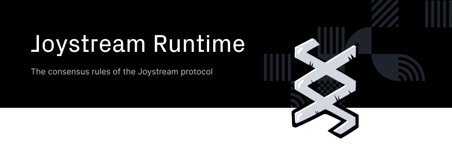

## Joystream Runtime

The runtime is the code that defines the consensus rules of the Joystream protocol.
It is compiled to WASM and lives on chain.
Joystream node execute the code's logic to validate transactions and blocks on the blockchain.

When building joystream-node as described in [../node/README.md](../node/README.md) with `cargo build --release`, in addition to the joystream-node binary being built the WASM blob artifact is produced in:

`target/release/wbuild/joystream-node-runtime/joystream_node_runtime.compact.wasm`

### Deployment

Deploying the compiled runtime on a live system can be done in one of two ways:

1. Joystream runtime upgrade proposals which will be voted on by the council. When the Joystream platform is live, this will be the only way to upgrade the chain's runtime code.

2. By creating  an extrinsic (transaction) signed with the sudo key invoking `system::setCode()`. This can be done either from the [Pioneer](/pioneer) extrinsics tab, or directly with an admin script. This way of upgrading the runtime code is intended for development and testnet phases only.

### Versioning the runtime

Versioning of the runtime is set in `runtime/src/lib.rs`
For detailed information about how to set correct version numbers when developing a new runtime, [see this](https://github.com/Joystream/joystream/issues/1)
